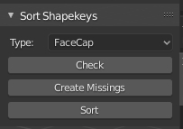

# Blender Add-on: Sort Shapekeys
FaceCap用にBlender上でシェイプキーを並べ替えるスクリプトです。  
 

## 機能一覧_Functions  
### Check  
選択しているオブジェクトにFaceCap用シェイプキー52個がすべて存在するかをチェックします。  
存在しなかったシェイプキー名をinfoに表示します。  

### Create Missings  
選択しているオブジェクトにFaceCap用シェイプキー52個がすべて存在するかをチェックし、  
存在しなかったシェイプキーを空シェイプキーとして作成します。  

### Sort  
選択しているオブジェクトのシェイプキーをFaceCap用にsortします。  
FaceCap用シェイプキー52個すべてが揃っていない場合、この操作はキャンセルされます。  
